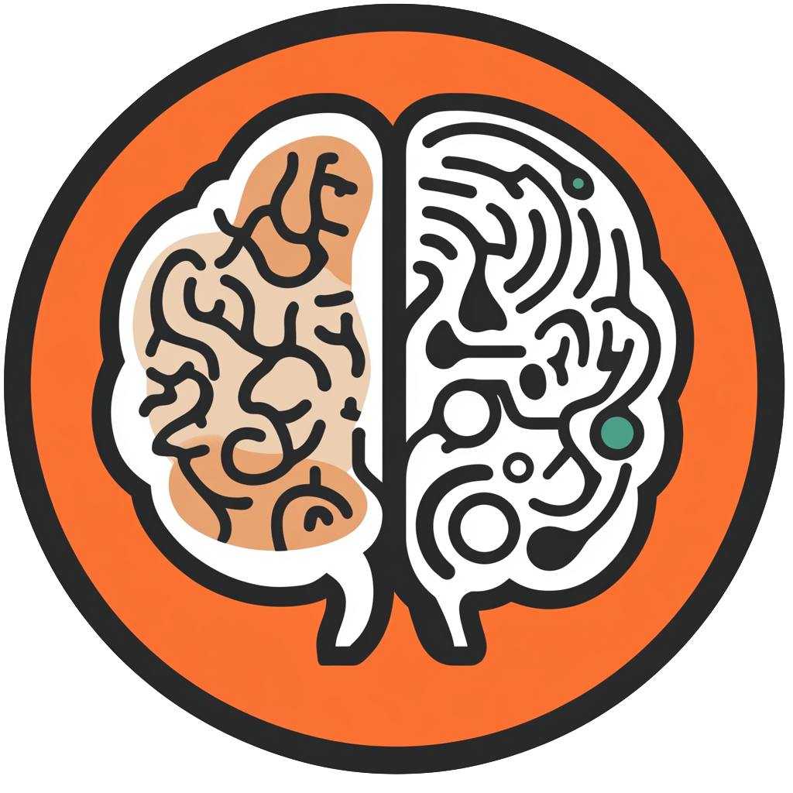

# First International TEXT2SPARQL Challenge

## Abstract

!!! info inline end ""

    

The TEXT2SPARQL Challenge is a competitive and collaborative benchmark designed to push the boundaries of natural language processing (NLP) and Semantic Web technologies, with a particular emphasis on Neurosymbolic AI approaches.
This challenge focuses on translating natural language questions into SPARQL queries, a structured query language for interacting with data in Resource Description Framework (RDF) formats, which are often used in knowledge graphs.
Neurosymbolic AI - a hybrid approach combining neural network-based models with symbolic reasoning techniques—plays a crucial role in this challenge by addressing both the interpretative power of neural networks and the logical precision of symbolic methods.
By incorporating Neurosymbolic AI, participants can develop models that better capture complex linguistic structures and the logical syntax required for accurate SPARQL query generation.
This integration not only enhances model performance but also opens up new possibilities for human-computer interaction, as it enables more intuitive and accessible interfaces for querying large-scale knowledge graphs.
Success in the TEXT2SPARQL Challenge has significant implications, from improving knowledge graph accessibility to advancing the development of intelligent systems capable of nuanced reasoning, thus marking an important step forward in AI-driven data interaction.

## Latest News

!!! info "2024-12-16 - Website online"

    text2sparql.aksw.org is online and can be managed over [this repository](https://github.com/AKSW/text2sparql.aksw.org).

