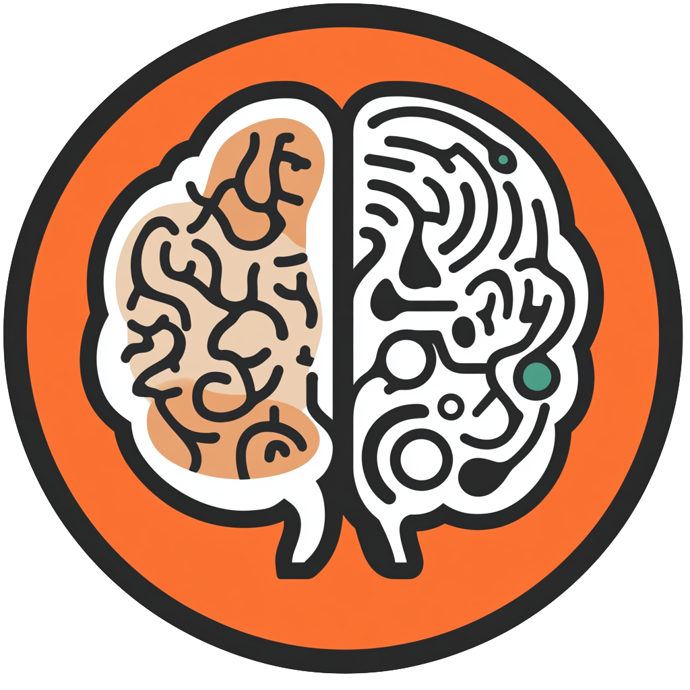

<!-- markdownlint-disable MD012 MD013 MD024 MD033 -->
# Second International TEXT2SPARQL Challenge

**Co-Located with [Text2KG](https://aiisc.ai/text2kg2026/) at [ESWC26](https://2026.eswc-conferences.org/)**

**Organized by [Agile Knowledge Engineering and Semantic Web (AKSW) e.V.](https://aksw.org/Association)**

## Abstract

!!! info inline end ""

    

The TEXT2SPARQL Challenge is a competitive and collaborative benchmark designed to push the boundaries of natural language processing (NLP) and Semantic Web technologies, with a particular emphasis on Neurosymbolic AI approaches.
This challenge focuses on translating natural language questions into SPARQL queries, a structured query language for interacting with data in Resource Description Framework (RDF) formats, which are often used in knowledge graphs.
Neurosymbolic AI - a hybrid approach combining neural network-based models with symbolic reasoning techniques—plays a crucial role in this challenge by addressing both the interpretative power of neural networks and the logical precision of symbolic methods.
By incorporating Neurosymbolic AI, participants can develop models that better capture complex linguistic structures and the logical syntax required for accurate SPARQL query generation.
This integration not only enhances model performance but also opens up new possibilities for human-computer interaction, as it enables more intuitive and accessible interfaces for querying large-scale knowledge graphs.
Success in the TEXT2SPARQL Challenge has significant implications, from improving knowledge graph accessibility to advancing the development of intelligent systems capable of nuanced reasoning, thus marking an important step forward in AI-driven data interaction.

## Latest News

!!! info "2026-04-20 - Registration reminder"
    
    We would like to remind all participants that the registration for the [ESWC pre-conference](https://2026.eswc-conferences.org/attending/registration/) is required for at least one of the team members.

!!! info "2026-04-20 - Endpoint Responses published!"

    As a first part of the [:material-chart-bar: Challenge Results](results/index.md) we publish the plain endpoint responses. Visit the GitHub issue page for the discussion of eventual problems and next steps.

!!! info "2026-04-15 - Data collection for the evaluation was completed!"

    Thank you all for your pariticipation, preparing the endpoints, and fixing eventual issues. We will release the test sets and results as planned! Be ready to check the questions and results for eventual problems and to discuss them on the GitHub issues page.

!!! info "2026-04-15 - Corporate dataset evaluation has started"

    Evaluation for the corporate dataset has started! Details about the systems running and completed evaluations as well as some eventual problems will be communicated on the GitHub issues page.

!!! info "2026-04-13 - Corporate dataset is out"

    Evaluation for this dataset will start within 24 hours from the communication to the challengers on GitHub!

!!! info "2026-04-10 - TEXT2SPARQL 2026 evaluation period starts today"

    Evaluation will start with the DBpedia question set. Per system progress is available on the GitHub issues page. We wish all participants good luck and a successful evaluation phase!

!!! info "2026-04-09 - TEXT2SPARQL 2026 evaluation period starts tomorrow"

    As we approach the evaluation phase of the TEXT2SPARQL 2026 Challenge we would like to ask all participants to make sure their API endpoints are up and running and that they are ready to receive evaluation questions.

!!! info "2026-02-06 - TEXT2SPARQL 2026 organization starts"

    We are happy to announce that we will organize a 2026 edition of the TEXT2SPARQL Challenge.

    All news and updates will be provided here.

