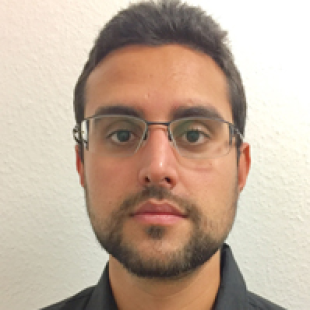

# :material-account-group: Organizing Committee

!!! info inline end ""

    

## Edgard Marx

[:material-linkedin:](https://www.linkedin.com/in/edgardmarx/)
[:material-link:](https://aksw.org/EdgardMarx)
[:simple-googlescholar:](https://scholar.google.com/citations?user=1jAHNZIAAAAJ&hl=en)

Edgard is Principal Data Scientist @eccenca and Project Manager at the Leipzig University of Applied Sciences (HTWK) working on Natural Language Processing (NLP) focusing on Question Answering, Semantic Search systems, Data Management, and Digital Twins for large enterprises. He has 10+ years of experience in software engineering, project management, and designing innovative solutions.

---

!!! info inline end ""

    

## Sebastian Tramp

[:material-linkedin:](https://www.linkedin.com/in/sebastiantramp/)
[:simple-orcid:](https://orcid.org/0000-0003-4707-2864)
[:material-link:](https://aksw.org/SebastianTramp)
[:simple-googlescholar:](https://scholar.google.com/citations?user=pyV5evQAAAAJ&hl=en)
[:simple-github:](https://github.com/seebi)

As Chief Technology Officer Sebastian is responsible for the technology and product development at eccenca.
He holds a PhD in computer science from the Leipzig University and authored more than 60 peer-reviewed publications.
Sebastian is a founding member of the renowned AKSW research group and was PC member, reviewer and organizer for more than 30 research and technology events as well as scientific journals including ESWC, Semantic Web Journal, and Journal of Web Semantics.
He also has led a number of key Linked Data technology projects, including the development of the data wiki OntoWiki.

---

!!! info inline end ""

    

## Diego Moussallem

[:material-linkedin:](https://linkedin.com/in/diegomoussallem)
[:material-link:](https://www.dice-research.org/DiegoMoussallem)
[:simple-googlescholar:](https://scholar.google.com/citations?user=4i5xtXEAAAAJ&hl=en)

Diego Moussallem develops algorithms for natural language processing using knowledge graphs with thee DICE group at Paderborn University.
He worked on different NLP tasks ranging from basic research in computational linguistics to Entity Linking, Machine Translation, Natural Language Generation, and Question Answering.
His work resulted in the first neural machine translation model augmented with knowledge graphs and one state-of-the-art framework in respect of multilingualism and knowledge-graph-based algorithms.

---
## Assistant Committee

- Paulo do Carmo, HTWK Leipzig, Germany
- Marcos Gôlo, USP, Brazil

---
## Program Committee (tentative)

- Axel Ngonga, University of Paderborn, Germany
- Muhammad Saleem, University of Paderborn, Germany
- Adrian Brasoveanu, Modul University Vienna, Austria
- Saeedeh Shekarpour, University of Dayton, USA
- Ricardo Usbeck, Leuphana Universität Lüneburg, Germany
- Diego Collarana, Fraunhofer, Germany
- Ricardo Marcacini, USP, Brazil
- Sanju Tiwari, Sharda University, India
- Gong Cheng, Nanjing University, China
- Andreas Both, HTWK, Germany
- Gustavo Publio, Schwarz IT, Germany
- Tommaso Soru, Serendipity AI, London

