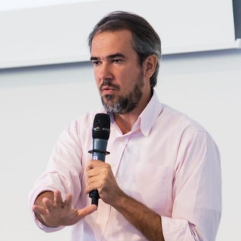
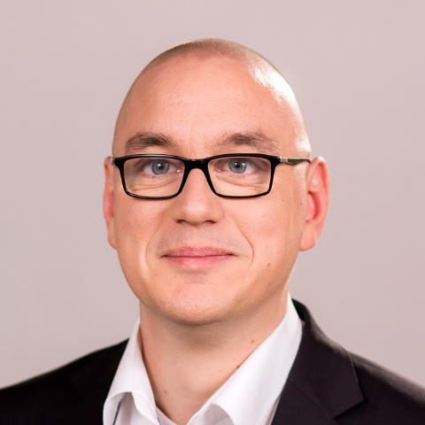

# :material-account-group: Organizing Committee

## Edgard Marx (contact person)

!!! info inline end ""

    

[:material-linkedin:](https://www.linkedin.com/in/edgardmarx/)
[:simple-orcid:](https://orcid.org/0000-0002-3111-9405)
[:material-link:](https://aksw.org/EdgardMarx)
[:simple-googlescholar:](https://scholar.google.com/citations?user=1jAHNZIAAAAJ&hl=en)

Edgard is Principal Data Scientist @eccenca and Project Manager at the Leipzig University of Applied Sciences (HTWK) working on Natural Language Processing (NLP) focusing on Question Answering, Semantic Search systems, Data Management, and Digital Twins for large enterprises. He has 10+ years of experience in software engineering, project management, and designing innovative solutions.

---
## Sebastian Tramp

!!! info inline end ""

    

[:material-linkedin:](https://www.linkedin.com/in/sebastiantramp/)
[:simple-orcid:](https://orcid.org/0000-0003-4707-2864)
[:material-link:](https://aksw.org/SebastianTramp)
[:simple-googlescholar:](https://scholar.google.com/citations?user=pyV5evQAAAAJ&hl=en)

As Chief Technology Officer Sebastian is responsible for the technology and product development at eccenca.
He holds a PhD in computer science from the Leipzig University and authored more than 60 peer-reviewed publications.
Sebastian is a founding member of the renowned AKSW research group and was PC member, reviewer and organizer for more than 30 research and technology events as well as scientific journals including ESWC, Semantic Web Journal, and Journal of Web Semantics.
He also has led a number of key Linked Data technology projects, including the development of the data wiki OntoWiki.

