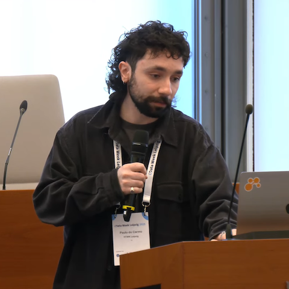
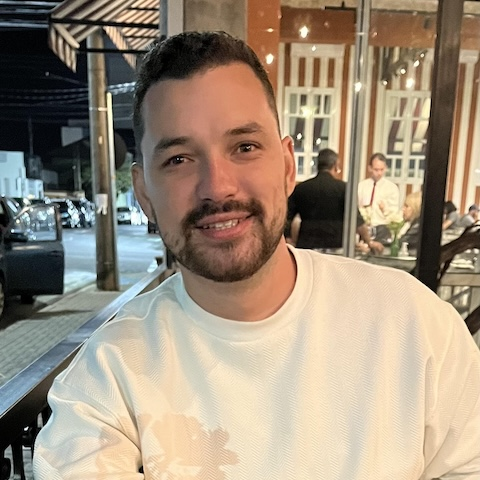

# :material-account-group: Organizing Committee

!!! info inline end ""

    

## Edgard Marx

[:material-linkedin:](https://www.linkedin.com/in/edgardmarx/)
[:material-link:](https://aksw.org/EdgardMarx)
[:simple-googlescholar:](https://scholar.google.com/citations?user=1jAHNZIAAAAJ&hl=en)

Edgard is Head of Data @ Byondis and leads the organization's efforts in data transformation, focusing on innovation in biotechnology and accelerating the development of impactful therapies. Edgard’s expertise spans optimization and the design of enterprise-wide data architectures that align with FAIR principles. Beyond his industrial leadership, Edgard holds a Ph.D. in Computer Science and has contributed to over 40 peer-reviewed publications and multiple international research projects, bringing a unique blend of academic excellence to his work in data science.

---

!!! info inline end ""

    

## Sebastian Tramp

[:material-linkedin:](https://www.linkedin.com/in/sebastiantramp/)
[:simple-orcid:](https://orcid.org/0000-0003-4707-2864)
[:material-link:](https://aksw.org/SebastianTramp)
[:simple-googlescholar:](https://scholar.google.com/citations?user=pyV5evQAAAAJ&hl=en)
[:simple-github:](https://github.com/seebi)

As Chief Technology Officer Sebastian is responsible for the technology and product development at eccenca.
He holds a PhD in computer science from the Leipzig University and authored more than 60 peer-reviewed publications.
Sebastian is a founding member of the renowned AKSW research group and was PC member, reviewer and organizer for more than 30 research and technology events as well as scientific journals including ESWC, Semantic Web Journal, and Journal of Web Semantics.
He also has led a number of key Linked Data technology projects, including the development of the data wiki OntoWiki.

---

!!! info inline end ""

    

## Paulo do Carmo

[:material-linkedin:](https://www.linkedin.com/in/paulo-do-carmo/)
[:material-link:](https://paulorvdc.github.io/)
[:simple-googlescholar:](https://scholar.google.com/citations?user=QRCC07AAAAAJ&hl=en)
[:simple-github:](https://github.com/paulorvdc)

Paulo is a Ph.D. candidate at Leibniz Universität Hannover and a researcher at the Institute for Applied Informatics in Leipzig.
He is involved in the Scalable and Quantum-Resilient Heterogeneous Edge Computing Enabling Trustworthy AI (SMARTY) EU project.
Paulo has authored numerous peer-reviewed papers in the field of Linked Open Data, including his work on the Natural Products Extraction from Academic Papers to Knowledge Graphs benchmark, which underpins the International Biochemical Knowledge Extraction Challenge.

---

!!! info inline end ""

    

## Marcos Gôlo

[:material-linkedin:](https://www.linkedin.com/in/marcosgolo/)
[:simple-orcid:](https://orcid.org/0000-0002-9093-8195)
[:simple-github:](https://github.com/GoloMarcos)
[:simple-googlescholar:](https://scholar.google.com/citations?user=CeyvhM8AAAAJ&hl=en)

Marcos Gôlo is a Ph.D. candidate in Computer Science at the University of São Paulo and authored more than 20 peer-reviewed publications. During his master’s, he received awards including the Best paper at ENIAC 2021, the Best Master’s Dissertation Award at WebMedia 2023, and 2nd-Best at the CSBC 2023. He is a recipient of the LatAm Google PhD Fellowship to research representation learning on one-class learning for graph neural networks. Marcos has also conducted two Ph.D. research exchanges at HTWK Leipzig (knowledge graph mining) and the University of Porto (data streams). During his Ph.D, he received awards including three 2nd-Best papers at KDMILE 2022, ENIAC 2024, and BRACIS 2024.

