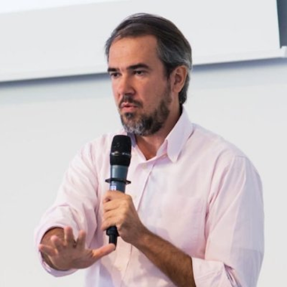
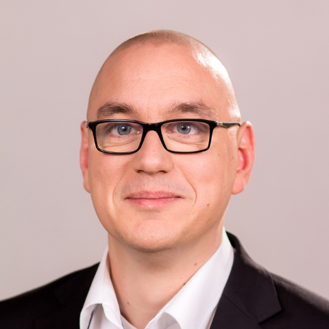

# :material-account-group: Organizing Committee

!!! info inline end ""

    

## Edgard Marx

[:material-linkedin:](https://www.linkedin.com/in/edgardmarx/)
[:material-link:](https://aksw.org/EdgardMarx)
[:simple-googlescholar:](https://scholar.google.com/citations?user=1jAHNZIAAAAJ&hl=en)

Edgard is Head of Data @ Byondis and leads the organization's efforts in data transformation, focusing on innovation in biotechnology and accelerating the development of impactful therapies. Edgard’s expertise spans optimization and the design of enterprise-wide data architectures that align with FAIR principles. Beyond his industrial leadership, Edgard holds a Ph.D. in Computer Science and has contributed to over 40 peer-reviewed publications and multiple international research projects, bringing a unique blend of academic excellence to his work in data science.

---

!!! info inline end ""

    

## Sebastian Tramp

[:material-linkedin:](https://www.linkedin.com/in/sebastiantramp/)
[:simple-orcid:](https://orcid.org/0000-0003-4707-2864)
[:material-link:](https://aksw.org/SebastianTramp)
[:simple-googlescholar:](https://scholar.google.com/citations?user=pyV5evQAAAAJ&hl=en)
[:simple-github:](https://github.com/seebi)

As Chief Technology Officer Sebastian is responsible for the technology and product development at eccenca.
He holds a PhD in computer science from the Leipzig University and authored more than 60 peer-reviewed publications.
Sebastian is a founding member of the renowned AKSW research group and was PC member, reviewer and organizer for more than 30 research and technology events as well as scientific journals including ESWC, Semantic Web Journal, and Journal of Web Semantics.
He also has led a number of key Linked Data technology projects, including the development of the data wiki OntoWiki.

---
## Assistant Committee

- Paulo do Carmo, HTWK Leipzig, Germany
- Marcos Gôlo, USP, Brazil

